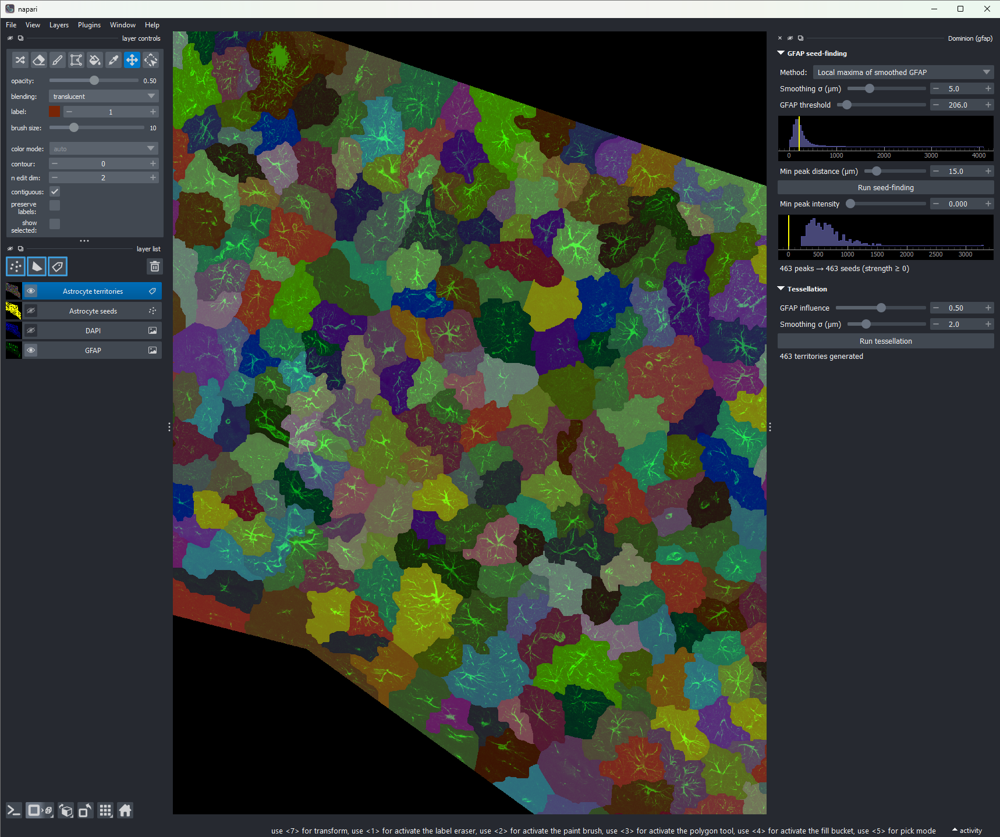

# Dominion

**DOM**ain **I**dentification for **N**etworks of **I**mmunolabeled **O**bject **N**eighborhoods.

A napari-based workflow for quantitatively segmenting and tessellating astrocyte
domains from 2D GFAP+DAPI immunofluorescence images.



*Dominion in `--mode gfap` on a tissue section. Right: GFAP seed-finding and
tessellation submenus. Center: the napari viewer showing watershed territories
(one color per cell) overlaid on the GFAP signal; here, 462 detected peaks
became 462 astrocyte territories.*

## What it does

Given a two-channel fluorescence image — GFAP (astrocyte intermediate filaments)
and DAPI (nuclei) — Dominion produces a per-cell partition of tissue space that
approximates each astrocyte's territorial domain. Downstream you can:

- count astrocytes per region,
- assign per-cell intensities for any additional channel,
- extract per-cell morphology metrics,
- describe neighbor relationships between cells.

The core idea is **tessellation**: astrocytes tile space with limited overlap,
but their full territories aren't visible in any single channel (GFAP labels only
~15% of an astrocyte's actual volume — the intermediate filaments — missing the
peripheral processes that make up most of the cell). Direct segmentation of GFAP
massively under-estimates territories. Tessellating the tissue mask from
identified astrocyte centers, using GFAP intensity as boundary evidence, is a
more honest approximation.

## Two pipeline modes

Dominion ships with two pipelines that share a tessellation step.

### `--mode dapi` (default): three-stage pipeline

```
[DAPI] -> StarDist nuclei -> filter by GFAP context -> seeded watershed on GFAP
```

1. **Nuclei segmentation** — StarDist's `2D_versatile_fluo` model segments
   every nucleus in DAPI.
2. **Astrocyte classification** — for each nucleus, compute a score from the
   surrounding GFAP (intensity within a disc, weighted by distance from the
   centroid). Threshold the score to select astrocyte seeds.
3. **Tessellation** — GFAP-guided seeded watershed within the tissue mask,
   one territory per kept seed.

Best when DAPI is clean and you want per-nucleus tracking through the pipeline.
The classification step is doing the work of filtering non-astrocyte nuclei.

### `--mode gfap`: two-stage pipeline

```
[GFAP] -> find peaks directly -> seeded watershed on GFAP
```

1. **GFAP seed-finding** — either local-maxima of smoothed GFAP, or peaks of
   the distance transform of thresholded GFAP. Each peak is taken as an
   astrocyte center.
2. **Tessellation** — same as dapi mode.

Best when DAPI is noisy or unreliable, or when you trust GFAP intensity as the
primary localization signal. Fewer parameters, more direct biological
interpretation. Won't necessarily catch every astrocyte (especially reactive
astrocytes with diffuse GFAP and no clear soma peak).

## Installation

Tested on Windows 11 with NVIDIA GPU. The GPU path uses TensorFlow 2.10
(the last native-Windows TF version with CUDA support), so the env must be on
Python 3.10.

```bash
# Create env with GPU TensorFlow
conda create -n dominion python=3.10 'tensorflow=2.10.0=gpu_py310*' -c defaults -y
conda activate dominion

# Pip-install the rest
pip install stardist csbdeep scikit-image tifffile "napari[all]" pyqtgraph magicgui qtpy

# napari 0.7 ships with PyQt6 by default; on some Windows installs PyQt6's
# DLLs fail to load. If you hit "QtBindingsNotFoundError", swap to PyQt5:
pip uninstall -y PyQt6 PyQt6-Qt6 PyQt6-sip
pip install PyQt5

# Install Dominion itself (editable)
git clone https://github.com/GSNautilus/Dominion.git
cd Dominion
pip install -e . --no-deps
```

CPU-only is supported (skip the conda TF step and install regular `tensorflow`),
but inference on multi-megapixel images is then minutes, not seconds.

For CPU-only or non-Windows setups, regular `pip install tensorflow` works; you
just won't get GPU acceleration on Windows native.

## Usage

```bash
python scripts/run_dominion.py path/to/image.tif                # dapi mode
python scripts/run_dominion.py path/to/image.tif --mode gfap    # gfap mode
```

The image must be a 2D CYX TIFF with at least two channels:

- channel 0: GFAP
- channel 1: DAPI (required for dapi mode, unused in gfap mode)

Non-tissue pixels are expected to be zero in both channels (the tissue mask is
derived from `(GFAP > 0) | (DAPI > 0)`). Pre-mask non-tissue before loading.

Pixel size is read from the TIFF resolution metadata (ImageJ convention: `unit=µm`,
`XResolution` in pixels/µm). If missing, the pipeline falls back to 1.0 µm/pixel
with a warning — fine for tuning but means slider radii in µm don't reflect real
distance.

### Working in the napari dock

Each stage has its own collapsible section with a **Run** button. Downstream
stages enable when upstream produces a result but don't auto-recompute — you
explicitly Run each step. This avoids wasting compute when tuning upstream
sliders.

One exception: in dapi mode, the **θ (seed threshold)** slider in classification
stays live — moving it instantly re-filters the cached scores. T / R / α
require a Run click. The gfap mode's **peak strength** slider behaves the same
way after the first Run.

When a stage's parameters change, downstream stages keep their visualization
(stale, for comparison) but their label warns you to click Run.

### Adjusting point sizes

The "Astrocyte seeds" layer uses uniform point size, so napari's built-in
**point size** slider in the layer controls works on all of them at once. The
size persists through Run / θ tweaks (only resets when you re-run nuclei
detection with a different number of detections).

## Caching

Each image gets a sibling cache directory: `image.tif → image.dominion_cache_<hash>/`.
The hash is the first 8 chars of the image's MD5, so re-running on the same
file is a cache hit; modifying the file invalidates the cache automatically.

Currently only StarDist nuclei outputs are cached (the only slow recomputation
in the dapi pipeline). Cache directories are git-ignored via `*.dominion_cache_*/`.

## Architecture

```
src/dominion/
  types.py                       # ImageData, NucleiResult, AstrocyteSeedsResult,
                                 # TessellationResult dataclasses
  state.py                       # AppState with subscribe/notify, downstream-clear
  io.py                          # TIFF loading, pixel-size parsing, tissue mask
  cache.py                       # per-image cache directory + npz load/save
  seedfind.py                    # pure GFAP-only seed-finding algorithms
  app.py                         # build_dock_widget(state, viewer, mode='dapi')
  widgets/common.py              # NumericSlider, HistogramSlider, CollapsibleSection
  submenu1_nuclei.py             # dapi mode stage 1: StarDist nuclei
  submenu2_seeds.py              # dapi mode stage 2: GFAP-based classification
  submenu3_tessellation.py       # both modes: GFAP-guided watershed
  submenu_a_gfap_seeds.py        # gfap mode stage 1: direct peak-finding
scripts/
  run_dominion.py                # CLI entry: loads image, builds app, runs napari
```

State flows along a fixed chain: `image → nuclei → seeds → tessellation`.
Setting any slot clears all downstream slots and notifies subscribers. Submenus
subscribe to the slot they consume; downstream submenus re-enable but don't
auto-recompute. The chain is identical in both modes — gfap mode just populates
`nuclei` with synthetic centroids (the peak coordinates) and `seeds` with all
indices kept.

`app.build_dock_widget(state, viewer, mode=...)` is the future-plugin entry
point. The CLI script (`scripts/run_dominion.py`) is the only filesystem
consumer; everything else takes pre-loaded `ImageData` via `AppState`. A future
napari plugin would call `build_dock_widget` directly.

## Limitations / what's not in this version

- **2D only.** Z-stacks are not handled; results from a single z-plane are
  cross-sections through 3D astrocyte domains, not full domains.
- **No ground-truth validation.** No sparse-label or hand-annotated comparison
  is built in. Quality is judged by visual inspection of the napari overlay and
  internal sanity checks (territory count, sizes, no leakage outside tissue).
- **No batch mode.** One image per invocation; parameters must be tuned in the
  GUI per image. Saving and reloading slider state is a logical next step but
  not implemented.
- **No quantitative export yet.** The pipeline produces `state.tessellation`
  with per-cell territory labels, but no CSV/feature table of per-territory
  metrics is written to disk. Easy to add — `regionprops_table` on the territory
  mask gets you area, centroid, intensity stats per cell.
- **StarDist needs sensible nucleus scale.** Native model expects nuclei of
  ~10–30 px diameter. If your image's pixel size leaves nuclei at ~3 px
  (typical for low-mag tissue overviews), upscale before loading or accept
  noisier nuclei segmentation.
- **TF 2.10 on Windows is frozen at 2022.** GPU StarDist on native Windows uses
  the last TF version with Windows CUDA support. For new TF features or active
  maintenance, run inside WSL2 with current TF.
- **Reactive astrocytes.** GFAP hypertrophy in injury models confounds both
  classification (in dapi mode) and seed-finding (in gfap mode). Local-maxima
  in gfap mode is particularly affected — diffuse GFAP without a clear soma
  peak gets under-counted. The distance-transform method is more robust to this.

## License

See repository.
